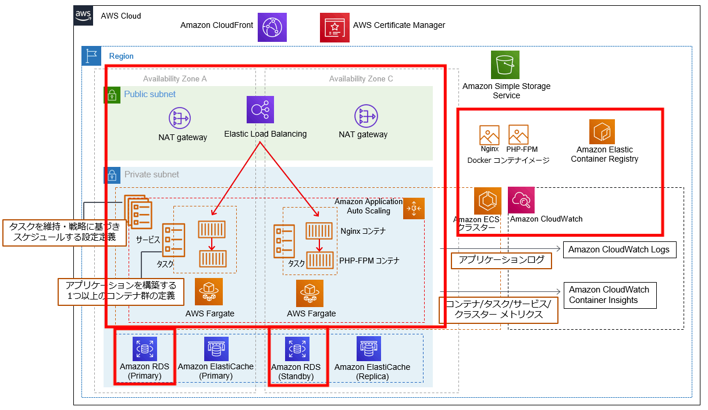

## インフラ構成
赤で囲っている部分のリソースを作成する



## 手順
1. .envファイルを作成
```
cp .env.example .env
```
2. .envファイルにそれぞれの値を入力
3. ~~Laravelプロジェクト作成~~ (srcを追加したので不要になった)
```
sh tools/util.sh createProject
```
4. ParameterStore作成
```
sh tools/util.sh createSystemParameter
```
5. ECR作成
```
sh tools/util.sh createEcr
```
6. buildしてpush
```
sh tools/aws-ecr-login.sh
sh tools/util.sh build
sh tools/util.sh push
```
7. S3バケット作成
```
sh tools/util.sh createBucket
```
8. デプロイ
```
sh tools/util.sh deploy
```


## スクラップ

https://zenn.dev/yoppy/scraps/e310e607c0b1fb
